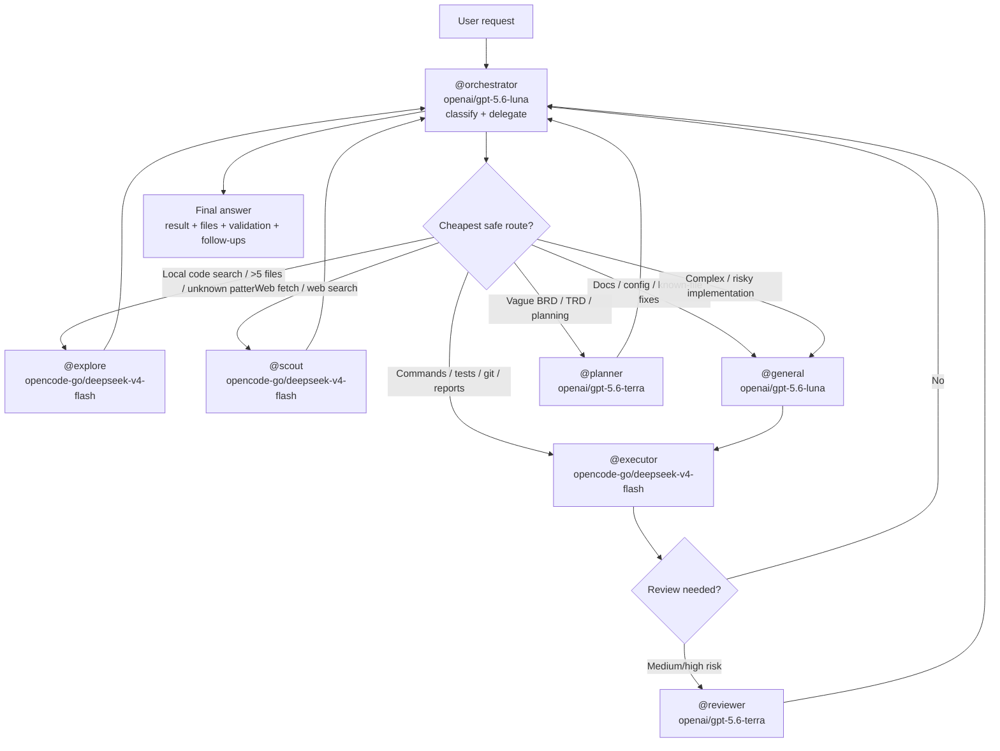

# Opencode Agent Workflow

Reproducible, version-controlled configuration for [opencode](https://opencode.ai/) multi-agent workflows.

## Quick Install

```bash
git clone git@github.com:daussho-astro/opencode-agent-workflow.git
cd opencode-agent-workflow
./install.sh
```

The installer **never overwrites existing files by default**. It copies only missing files and skips anything already present. If you already have `~/.config/opencode/opencode.json`, the installer writes the repo version as `~/.config/opencode/opencode.workflow-template.json` instead of replacing your config.

It also installs prompts, instructions, commands, plugins, skills, and npm dependencies used by the workflow.

> **Flags:**
> - `--dry-run` — preview actions without copying files.
> - `--yes` — skip the confirmation prompt for safe actions (does **not** imply overwrite).
> - `--overwrite` — **explicitly replace existing files** after creating a timestamped backup. Use with caution.

## Prerequisites

- **opencode CLI** installed on your system.
- **git** installed.
- **npm** installed if you want npm-based plugins such as `opencode-wakelock` installed automatically.
- **Provider authentication** completed by you (the installer does not handle secrets).
- **Restart opencode** after install so the new configuration loads.

## If you use an AI agent to install this

Copy and paste the prompt below into your agent:

> You are helping me install the opencode-agent-workflow configuration.
> Safety rules:
> 1. Do **not** overwrite any existing user files unless I explicitly say `--overwrite`.
> 2. If `~/.config/opencode/opencode.json` already exists, **stop and ask me** whether to:
>    - merge agent/default_agent/instructions manually, or
>    - run `./install.sh --overwrite` to replace it.
> 3. Clone the repository:
>    `git clone git@github.com:daussho-astro/opencode-agent-workflow.git`
> 4. Inspect the repo files (README.md, install.sh, opencode.json, prompts/, instructions/, commands/, plugins/, skills/) to understand what will be installed.
> 5. Run `./install.sh --dry-run` first, then `./install.sh`.
> 6. After installation, validate that `~/.config/opencode/opencode.json` exists and is valid JSON.
> 7. Do not read, print, or commit any secrets (especially `~/.local/share/opencode/auth.json` or API keys).
> 8. Report the final installation status and next steps.

## Purpose

This repository stores the full opencode agent configuration — models, prompts, instructions, commands, plugins, skills, and orchestration rules — so the workflow can be replicated across machines, shared with teammates, and restored after resets.

## Workflow Diagram



Routing is prompt-guided: use the smallest capable agent, then promote work when risk or complexity grows. The active configuration defines nine agents: `orchestrator`, `general`, `explore`, `executor`, `scout`, `planner`, `reviewer`, `frontend-designer`, and `ui-reviewer`. The `general-lite` and `reviewer-lite` prompt files remain unreferenced backups; they are not active agents.

## Configuration Architecture

- **Global runtime source:** `~/.config/opencode/opencode.json` and its prompt/instruction files are loaded by opencode.
- **Repository backup:** this repository mirrors the configuration and source files for review, restoration, and installation. Repository-to-global installation is handled by `install.sh`; backup refresh runs in the opposite direction. See [AGENTS.md](AGENTS.md).
- **Prompt backups:** nine prompt files are referenced by the active agents; `prompts/general-lite-guideline.md` and `prompts/reviewer-lite-guideline.md` are unreferenced backups.
- **Permissions:** each agent has an explicit tool boundary. Read-only agents such as `explore` and `scout` cannot edit or write; `executor` can run commands but cannot edit or write; implementation agents receive edit/write access as configured. `permission.write` is a no-op in opencode, so file modification permission is controlled by `permission.edit`.
- **Policy plugin boundary:** `plugins/subagent-policy.ts` is present in the repository backup but is not loaded by the current `plugin` list in `opencode.json`.

## Delegation Quality Rules

Good orchestration is not only choosing the correct subagent. It is also packaging enough context so the subagent can start without broad repo discovery.

Before delegating implementation work, ensure the prompt includes:
- exact task outcome
- absolute workspace root
- one clear starting point:
  - absolute file path, or
  - module/directory path, or
  - symbol/function/class name, or
  - bounded search area
- expected output / success criteria
- constraints / non-goals when relevant

If that context is missing, delegate discovery to `@explore` first, then send the implementation task with the discovered paths/symbols.

Heuristic:
- good delegation = 0-2 targeted searches
- bad delegation = broad repo exploration just to find where to start

Recommended prompt style for subagents:
- concise
- labeled
- bullet-based
- one fact per line
- explicit constraints first

Default skeleton:

```text
Branch: <branch or unknown>
Workspace root: <absolute path>
Dirty: <yes/no/unknown>
Staged: <yes/no/unknown>

Task:
- <exact task>

Known context:
- <absolute file path>
- <module/path>
- <symbol/function/class>
- <error/symptom/example>

Do:
- <required action>

Do not:
- <non-goal>

Return:
- <exact expected output>

Verify:
- <command or validation method, if relevant>
```

## Agent / Model Table

| Agent | Model | Mode | Role |
|-------|-------|------|------|
| `@orchestrator` | `openai/gpt-5.6-luna` | primary | Plan, delegate, synthesize |
| `@general` | `openai/gpt-5.6-luna` | subagent | Multi-step implementation, edits, coordination |
| `@planner` | `openai/gpt-5.6-terra` | subagent | BRD → TRD + task breakdown |
| `@reviewer` | `openai/gpt-5.6-terra` | subagent | Medium/high-risk review |
| `@explore` | `opencode-go/deepseek-v4-flash` | subagent | Fast codebase exploration |
| `@executor` | `opencode-go/deepseek-v4-flash` | subagent | Bash commands, tests, builds |
| `@scout` | `opencode-go/deepseek-v4-flash` | subagent | Web fetch + search |
| `@frontend-designer` | `openai/gpt-5.6-luna` | subagent | Frontend/UI implementation |
| `@ui-reviewer` | `openai/gpt-5.6-terra` | subagent | UI/UX review |

## What the installer does

- **Safe by default:** existing files are never overwritten.
- **Missing files only:** copies prompts, instructions, commands, plugins, skills, and package files only if they do not already exist.
- **Template mode:** if `~/.config/opencode/opencode.json` already exists, the repo config is written as `opencode.workflow-template.json` so you can merge changes manually.
- **Overwrite mode:** if you pass `--overwrite`, existing files are backed up to a timestamped directory under `~/.config/opencode/backups/` before being replaced.
- **Dependencies:** runs `npm install --prefix ~/.config/opencode` when `package.json` is present and npm is available.
- **Validates** JSON syntax with `python3` if available.
- **Checks** that the `opencode` CLI is present and prints its version.

## Validation Commands

After install, verify the configuration is active:

```bash
# Check opencode version
opencode --version

# Validate JSON
python3 -m json.tool ~/.config/opencode/opencode.json > /dev/null && echo "JSON valid"

# List loaded agents (inside an opencode session)
# Ask: "list my agents"
```

## Provider / Auth Notes

- **This repo defines provider metadata, not credentials.** Authentication remains machine-specific.
- **You must authenticate providers yourself.**
- Common providers used by this config include `openai`, `opencode-go`, `9router`, and `astronauts`.
- To authenticate, run:
  ```bash
  opencode providers list
  ```
  Then follow the opencode login flow for each provider you plan to use.

## Troubleshooting

| Problem | Solution |
|---|---|
| `opencode: command not found` | Install the opencode CLI and ensure it is in your PATH. |
| Provider auth errors / models unavailable | Run `opencode providers list` and complete login for the providers you intend to use. |
| Models still not listed after install | **Restart opencode** completely so the new config is loaded. |
| Something broke after install | Restore your backup from `~/.config/opencode/backups/<timestamp>/`. |
| Installer reports invalid JSON | Check `opencode.json` in this repo for syntax errors and open an issue. |

## No-Secrets Warning

- **Do not commit `.env`, `auth.json`, or any API keys.**
- This repo intentionally excludes `~/.local/share/opencode/auth.json`.
- If you add custom provider credentials to `opencode.json`, keep them out of version control.

## Restart Opencode Reminder

After running `install.sh`, **restart your opencode session** (or start a new one) so the updated configuration is loaded.

```bash
# Exit current session, then:
opencode
```

## Directory Layout

```
opencode-agent-workflow/
├── opencode.json              # Main config (agents, models, permissions)
├── install.sh                 # One-command install script (safe, non-overwrite default)
├── README.md                  # This file
├── AGENT_INSTALL.md           # Guide for AI agents
├── .gitignore                 # Excludes secrets/backups
├── prompts/
│   ├── orchestrator-guideline.md
│   ├── general-guideline.md
│   ├── general-lite-guideline.md
│   ├── explore-guideline.md
│   ├── executor-guideline.md
│   ├── scout-guideline.md
│   ├── reviewer-guideline.md
│   ├── reviewer-lite-guideline.md
│   ├── frontend-designer-guideline.md
│   ├── ui-reviewer-guideline.md
│   └── planner-guideline.md
├── instructions/
│   ├── parallel-reads.md
│   ├── general-guideline.md
│   ├── coding-guideline.md
│   └── search-performance.md
├── commands/
│   └── retitle.md
├── plugins/
│   └── subagent-policy.ts
├── skills/
│   └── graphify/
│       ├── SKILL.md
│       └── .graphify_version
├── package.json
└── package-lock.json
```
