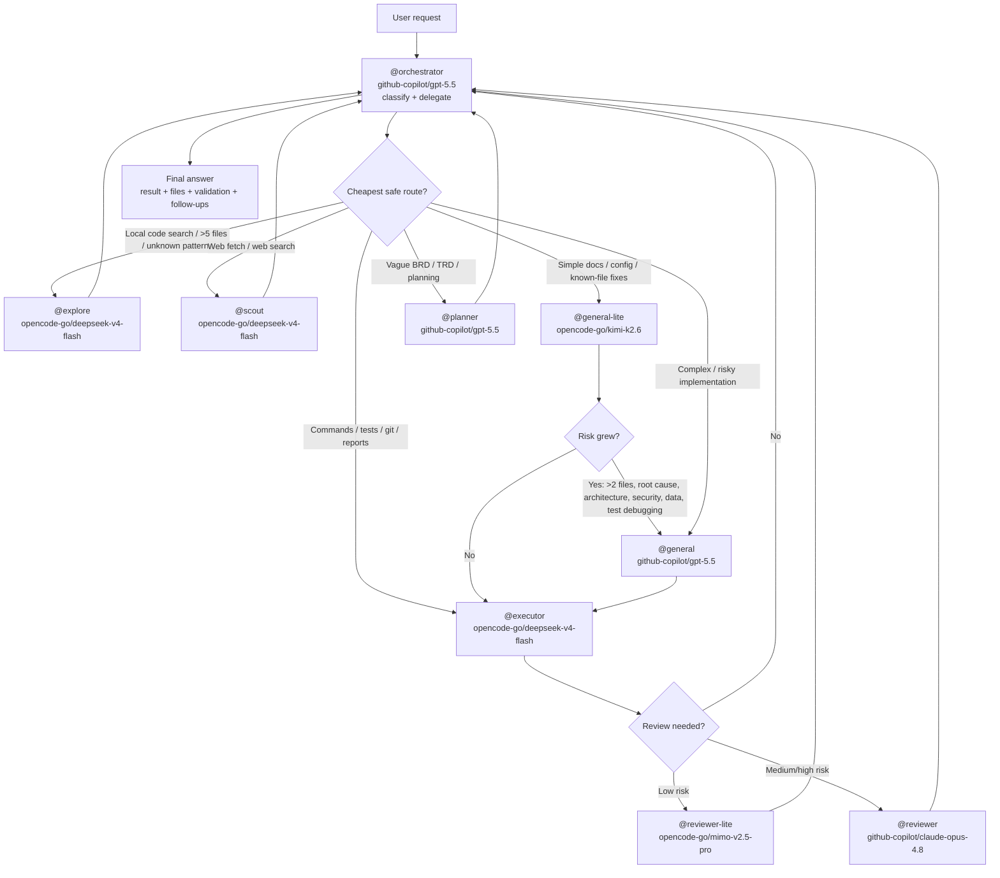

# Opencode Agent Workflow

Reproducible, version-controlled configuration for [opencode](https://opencode.ai/) multi-agent workflows.

## Quick Install

```bash
git clone git@github.com:daussho-astro/opencode-agent-workflow.git
cd opencode-agent-workflow
./install.sh
```

The installer **never overwrites existing files by default**. It copies only missing files and skips anything already present. If you already have `~/.config/opencode/opencode.json`, the installer writes the repo version as `~/.config/opencode/opencode.workflow-template.json` instead of replacing your config.

> **Flags:**
> - `--dry-run` — preview actions without copying files.
> - `--yes` — skip the confirmation prompt for safe actions (does **not** imply overwrite).
> - `--overwrite` — **explicitly replace existing files** after creating a timestamped backup. Use with caution.

## Prerequisites

- **opencode CLI** installed on your system.
- **git** installed.
- **Provider authentication** completed by you (the installer does not handle secrets).
- **Restart opencode** after install so the new configuration loads.

## If you use an AI agent to install this

Copy and paste the prompt below into your agent:

> You are helping me install the opencode-agent-workflow configuration.
> Safety rules:
> 1. Do **not** overwrite any existing user files unless I explicitly say `--overwrite`.
> 2. If `~/.config/opencode/opencode.json` already exists, **stop and ask me** whether to:
>    - merge agent/default_agent/instructions manually, or
>    - run `./install.sh --overwrite` to replace it.
> 3. Clone the repository:
>    `git clone git@github.com:daussho-astro/opencode-agent-workflow.git`
> 4. Inspect the repo files (README.md, install.sh, opencode.json, prompts/, instructions/) to understand what will be installed.
> 5. Run `./install.sh --dry-run` first, then `./install.sh`.
> 6. After installation, validate that `~/.config/opencode/opencode.json` exists and is valid JSON.
> 7. Do not read, print, or commit any secrets (especially `~/.local/share/opencode/auth.json` or API keys).
> 8. Report the final installation status and next steps.

## Purpose

This repository stores the full opencode agent configuration — models, prompts, instructions, and orchestration rules — so the workflow can be replicated across machines, shared with teammates, and restored after resets.

## Workflow Diagram



Policy: **default cheap, promote by risk**. Lite agents handle safe/simple work; strong agents are reserved for risky implementation, planning, and medium/high-risk review.

## Agent / Model Table

| Agent | Model | Mode | Role |
|-------|-------|------|------|
| `@orchestrator` | `github-copilot/gpt-5.5` | primary | Plan, delegate, synthesize |
| `@general` | `github-copilot/gpt-5.5` | subagent | Multi-step implementation, edits, coordination |
| `@general-lite` | `opencode-go/kimi-k2.6` | subagent | Low-cost simple edits, docs, config fixes |
| `@planner` | `github-copilot/gpt-5.5` | subagent | BRD → TRD + task breakdown |
| `@reviewer` | `github-copilot/claude-opus-4.8` | subagent | Medium/high-risk review |
| `@reviewer-lite` | `opencode-go/mimo-v2.5-pro` | subagent | Quick low-risk review |
| `@explore` | `opencode-go/deepseek-v4-flash` | subagent | Fast codebase exploration |
| `@executor` | `opencode-go/deepseek-v4-flash` | subagent | Bash commands, tests, builds |
| `@scout` | `opencode-go/deepseek-v4-flash` | subagent | Web fetch + search |

## What the installer does

- **Safe by default:** existing files are never overwritten.
- **Missing files only:** copies prompts and instructions only if they do not already exist.
- **Template mode:** if `~/.config/opencode/opencode.json` already exists, the repo config is written as `opencode.workflow-template.json` so you can merge changes manually.
- **Overwrite mode:** if you pass `--overwrite`, existing files are backed up to a timestamped directory under `~/.config/opencode/backups/` before being replaced.
- **Validates** JSON syntax with `python3` if available.
- **Checks** that the `opencode` CLI is present and prints its version.

## Validation Commands

After install, verify the configuration is active:

```bash
# Check opencode version
opencode --version

# Validate JSON
python3 -m json.tool ~/.config/opencode/opencode.json > /dev/null && echo "JSON valid"

# List loaded agents (inside an opencode session)
# Ask: "list my agents"
```

## Provider / Auth Notes

- **This repo intentionally does not define providers or credentials.** Providers are user-specific and must be configured separately.
- **You must authenticate providers yourself.**
- Supported providers in this config: `github-copilot`, `opencode-go`.
- To authenticate, run:
  ```bash
  opencode providers list
  ```
  Then follow the opencode login flow for GitHub Copilot and/or OpenCode Go as needed.

## Troubleshooting

| Problem | Solution |
|---|---|
| `opencode: command not found` | Install the opencode CLI and ensure it is in your PATH. |
| Provider auth errors / models unavailable | Run `opencode providers list` and complete login for the providers you intend to use. |
| Models still not listed after install | **Restart opencode** completely so the new config is loaded. |
| Something broke after install | Restore your backup from `~/.config/opencode/backups/<timestamp>/`. |
| Installer reports invalid JSON | Check `opencode.json` in this repo for syntax errors and open an issue. |

## No-Secrets Warning

- **Do not commit `.env`, `auth.json`, or any API keys.**
- This repo intentionally excludes `~/.local/share/opencode/auth.json`.
- If you add custom provider credentials to `opencode.json`, keep them out of version control.

## Restart Opencode Reminder

After running `install.sh`, **restart your opencode session** (or start a new one) so the updated configuration is loaded.

```bash
# Exit current session, then:
opencode
```

## Directory Layout

```
opencode-agent-workflow/
├── opencode.json              # Main config (agents, models, permissions)
├── install.sh                 # One-command install script (safe, non-overwrite default)
├── README.md                  # This file
├── AGENT_INSTALL.md           # Guide for AI agents
├── .gitignore                 # Excludes secrets/backups
├── prompts/
│   ├── orchestrator-guideline.md
│   ├── general-guideline.md
│   ├── explore-guideline.md
│   ├── executor-guideline.md
│   ├── scout-guideline.md
│   ├── reviewer-guideline.md
│   └── planner-guideline.md
└── instructions/
    ├── parallel-reads.md
    ├── general-guideline.md
    └── coding-guideline.md
```
